# IntellMeet

**AI-Powered Enterprise Meeting & Collaboration Platform**

[](.github/workflows/ci.yml)
[](#)
[](#)

IntellMeet transforms hybrid meetings into actionable outcomes: real-time video, AI summaries, Kanban task sync, and team analytics — built for the **Zidio Development LogicVeda March 2026** internship submission.

---

## Submission Deliverables

| # | Deliverable | Location |
| :---: | :--- | :--- |
| 1 | **Project Documentation (PDF)** | Submit separately (content summarized in repository / chat) |
| 2 | **Live Public Demo (HTTPS)** | [https://mariam-intellmeet-app.vercel.app](https://mariam-intellmeet-app.vercel.app) — deploy via vercel (see below) |
| 3 | **GitHub Repository** | [github.com/mariammgamall/zidio-webdevelopment-internship](https://github.com/mariammgamall/zidio-webdevelopment-internship) |
| 4 | **README** | This file |
| 5 | **Demo Video** | *Record 3–7 min multi-user session (YouTube unlisted / Loom)* |

**Author:** Mariam Gamal Elsayed · ID: ZIDIOXEM8tD · June 2026

---

## Live Demo

**URL:** [https://mariam-intellmeet-app.vercel.app](https://mariam-intellmeet-app.vercel.app)

> **Note:** The demo URL is live only after you deploy to Render using the steps in [Deploy on Render](#deploy-on-render-https-live-demo). Free-tier services may take ~30s to wake on first visit.

No sign-up required for evaluators — use the **"Try Live Demo"** button on the landing page.

| Credential | Value |
| :--- | :--- |
| Email | `mariam@intellmeet.app` |
| Password | `Mariam@1234` |

**Quick evaluator flow:**

1. Open the live URL → click **Try Live Demo**
2. Create or join a meeting from the dashboard
3. Open a second browser/incognito window to test multi-user video + chat
4. End the meeting → view AI summary and action items on the dashboard
5. Visit **Kanban** and **Analytics** from the navigation

Local development: `http://localhost:5173`

---

## Features

| ID | Feature | Description |
| :---: | :--- | :--- |
| F01 | **Auth & Profiles** | JWT + refresh tokens, bcrypt, Google OAuth, Cloudinary avatars, auth rate limiting |
| F02 | **Video Meetings** | WebRTC mesh video, screen share, recording controls, participant presence |
| F03 | **AI Intelligence** | Post-meeting summaries (OpenAI → HuggingFace → local fallback), action-item extraction |
| F04 | **Real-Time Collab** | In-meeting chat, typing indicators, shared notes via Socket.io |
| F05 | **Post-Meeting Dashboard** | History, transcripts, summaries, CSV export |
| F06 | **Kanban & Teams** | Team workspaces, drag-and-drop boards, live sync |
| F07 | **Notifications** | Real-time alerts for mentions, tasks, and assignments |
| F08 | **Observability** | `/health`, Prometheus `/metrics`, Grafana, Sentry |

---

## Application Screenshots

### 🔑 Authentication & Workspace Setup

| Screen | Preview |
| :--- | :--- |
| **Landing Page**<br>Clean, modern landing page prompting users to join or host meetings. | <a href="screenshots/01_landing_page.png">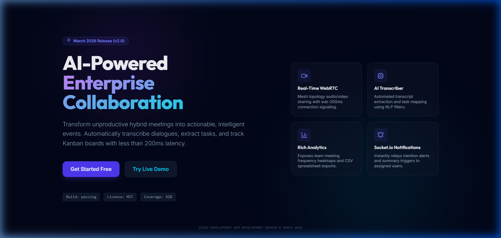</a> |
| **Authentication Flow**<br>Secure login and registration with rate limiting and credential checks. | <a href="screenshots/02_auth_login.png">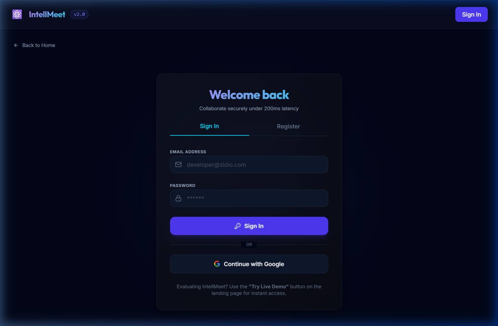</a> <a href="screenshots/02_auth_register.png">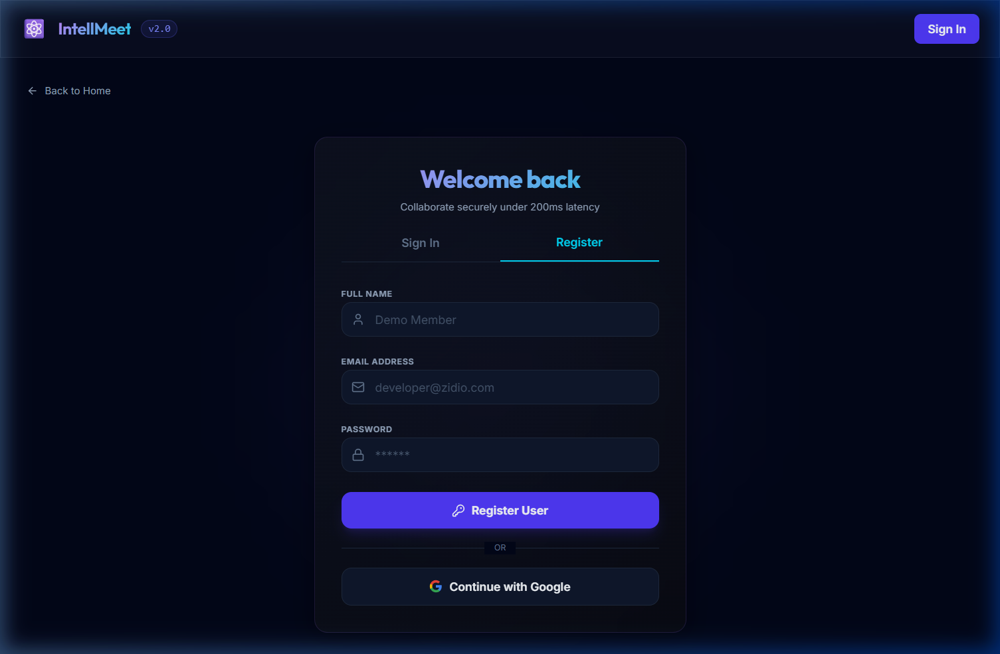</a> |

### 📊 Dashboard & Analytics

| Screen | Preview |
| :--- | :--- |
| **Intelligent Dashboard**<br>Centrally manage past meetings, active workspaces, and user actions. | <a href="screenshots/03_dashboard.png">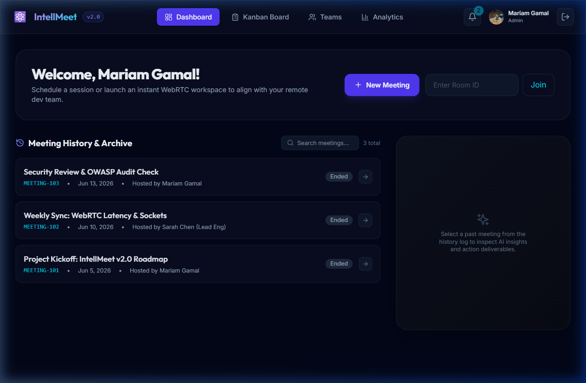</a> |
| **Productivity Analytics**<br>Comprehensive charts showing meeting duration, activity logs, and trends. | <a href="screenshots/08_productivity_analytics.png">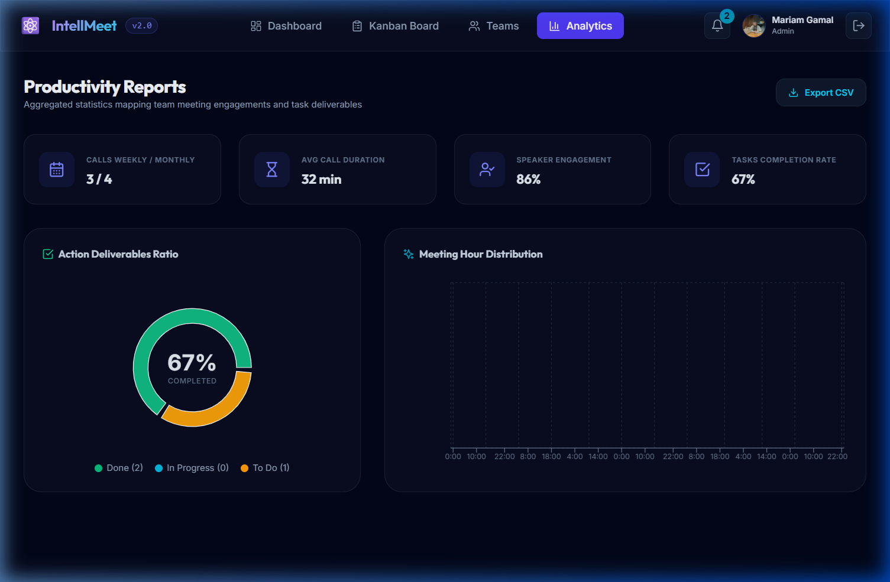</a> |
| **User Profile Settings**<br>Update personal details, upload custom avatars, and change password securely. | <a href="screenshots/09_user_profile.png">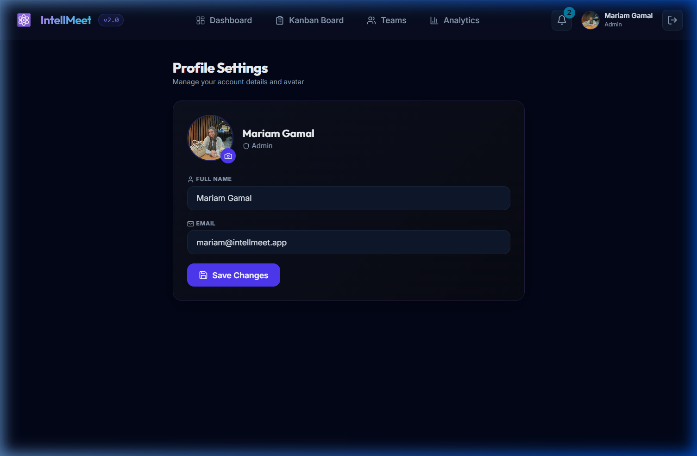</a> |

### 🎥 Live Collaboration & AI Insights

| Screen | Preview |
| :--- | :--- |
| **Active Meeting Room**<br>Real-time mesh video, screen sharing, participants list, and collaborative meeting tools. | <a href="screenshots/04_active_meeting_room.png">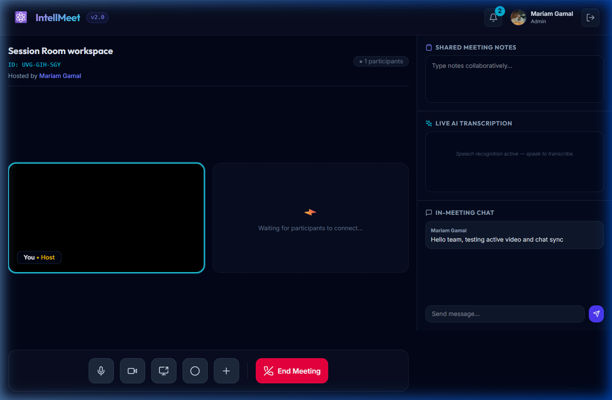</a> |
| **Meeting AI Summary (1/2)**<br>Post-meeting overview highlighting participants and general stats. | <a href="screenshots/05_meeting_ai_summary_1.png">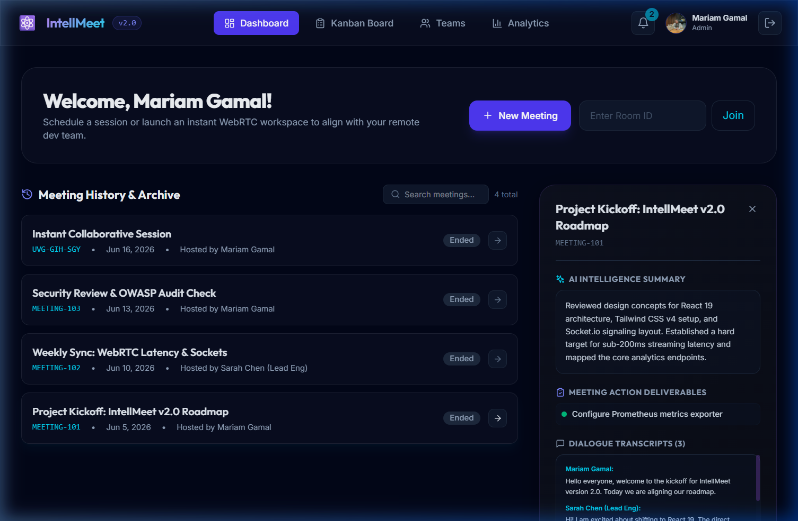</a> |
| **Meeting AI Summary (2/2)**<br>AI-extracted action items, detailed timelines, and transcription details. | <a href="screenshots/05_meeting_ai_summary_2.png">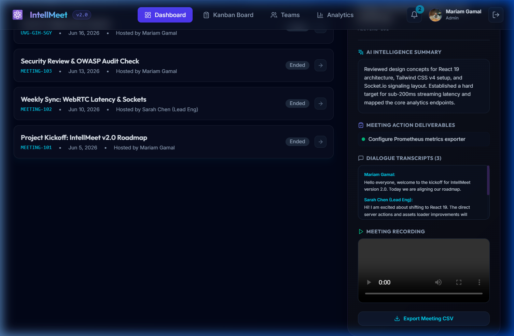</a> |

### 📋 Kanban Boards & Team Management

| Screen | Preview |
| :--- | :--- |
| **Kanban Project Board**<br>Drag-and-drop tasks, statuses, priorities, and assignments for smooth sync. | <a href="screenshots/06_kanban_board.png">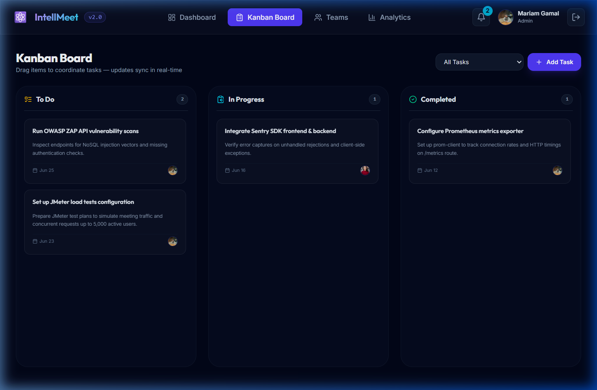</a> |
| **Teams Management (1/2)**<br>Create new teams, manage workspace roles, and define settings. | <a href="screenshots/07_teams_management_1.png">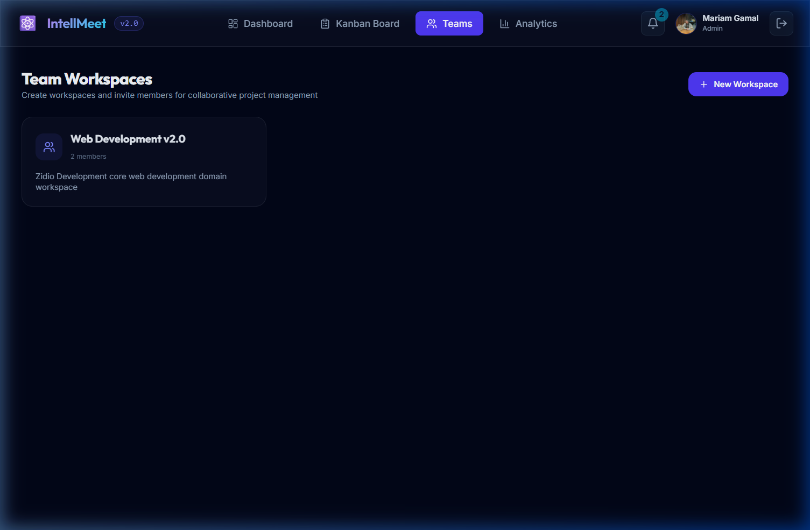</a> |
| **Teams Management (2/2)**<br>Detailed team details, member lists, and active collaborative projects. | <a href="screenshots/07_teams_management_2.png">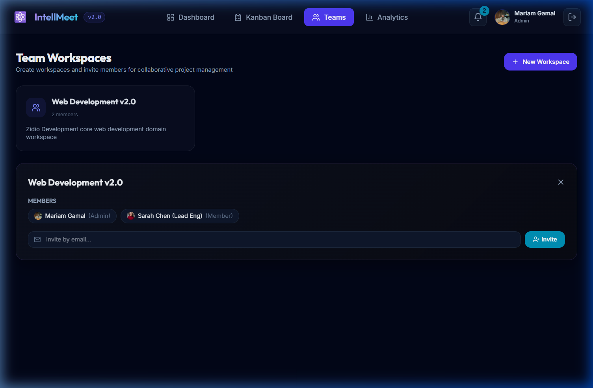</a> |

---

## Architecture

```
┌─────────────────────┐     HTTPS (REST + WebSocket)
│  React 19 + Vite    │ ─────────────────────────────► ┌──────────────────┐
│  Zustand · Query    │                                │  Nginx Ingress   │
└─────────────────────┘                                └────────┬─────────┘
                                                                │
                       ┌────────────────────────────────────────┼────────────────────┐
                       │                                        ▼                    │
                       │  ┌─────────────────────────────────────────────────────┐    │
                       │  │         Express API + Socket.io + WebRTC Signal    │    │
                       │  └───────┬─────────────┬──────────────┬───────────────┘    │
                       │          │             │              │                     │
                       │          ▼             ▼              ▼                     │
                       │     MongoDB        Redis/Bull     Cloudinary                │
                       └─────────────────────────────────────────────────────────────┘
                                         Prometheus · Grafana · Sentry
```

---

## Tech Stack

| Layer | Technologies |
| :--- | :--- |
| **Frontend** | React 19, TypeScript, Vite 6, Tailwind CSS v4, Zustand, TanStack Query |
| **Backend** | Node.js 18, Express (ESM), Socket.io, Bull, Mongoose |
| **Data** | MongoDB, Redis |
| **Real-Time** | WebRTC (STUN), Socket.io |
| **AI** | OpenAI GPT-4o-mini, HuggingFace BART, browser Speech API (transcription) |
| **DevOps** | Docker, Docker Compose, Kubernetes, Helm, GitHub Actions, Render |

---

## Quick Start

### Prerequisites

- Node.js 18+
- MongoDB and Redis (or use Docker Compose for everything)

### Option A — Docker Compose (recommended)

```bash
git clone https://github.com/mariammgamall/zidio-webdevelopment-internship.git
cd zidio-webdevelopment-internship
docker compose up --build
```

| Service | URL |
| :--- | :--- |
| Frontend | http://localhost:5173 |
| API | http://localhost:5000 |
| Prometheus | http://localhost:9090 |
| Grafana | http://localhost:3000 |

### Option B — Manual setup

```bash
# Backend
cd server && npm install && cp ../.env.example .env && npm run dev

# Frontend (new terminal)
cd client && npm install && npm run dev
```

Copy [`.env.example`](.env.example) and configure `MONGO_URI`, `REDIS_HOST`, and optional AI keys. The app runs with mock AI fallbacks when keys are empty.

---

## Deploy on Render (HTTPS live demo)

Follow these steps to make **https://mariam-intellmeet-app.vercel.app** work.

### 1. Push code to GitHub

```bash
git add .
git commit -m "feat: IntellMeet v2.0 submission"
git remote add origin https://github.com/mariammgamall/zidio-webdevelopment-internship.git
git push -u origin main
```

### 2. Create a Render account

Sign up at [render.com](https://render.com) (free tier is enough for the demo).

### 3. Deploy with Blueprint

1. Open [Render Dashboard](https://dashboard.render.com)
2. Click **New** → **Blueprint**
3. Connect GitHub and select **mariammgamall/zidio-webdevelopment-internship**
4. Render reads [`render.yaml`](render.yaml) and creates four resources:
   - `intellmeet-mongodb` — MongoDB database
   - `intellmeet-redis` — Redis cache
   - `intellmeet-api` — Express backend (Docker)
   - `intellmeet-client` — React frontend + Nginx (Docker)
5. Click **Apply** and wait for all services to show **Live** (~10–15 min on first build)

### 4. Verify URLs

| Service | URL |
| :--- | :--- |
| **Demo (evaluators)** | https://mariam-intellmeet-app.vercel.app |
| API health | https://intellmeet-api.onrender.com/health |

### 5. Fix CORS (only if login fails)

If **Try Live Demo** fails with a CORS error:

1. Open **intellmeet-api** → **Environment**
2. Set `CLIENT_ORIGIN` = `https://mariam-intellmeet-app.vercel.app`
3. Click **Manual Deploy** → **Deploy latest commit**

### 6. Test the demo

1. Visit https://mariam-intellmeet-app.vercel.app (refresh once if cold start is slow)
2. Click **Try Live Demo**
3. Create a meeting; join from a second browser/incognito tab
4. End the meeting and check the AI summary on the dashboard

### Free tier notes

- Services sleep after ~15 min of inactivity; first load can take ~30 seconds
- MongoDB free tier has storage limits — sufficient for evaluation
- AI summaries use a local fallback when `OPENAI_API_KEY` is not set

### Troubleshooting

| Issue | Fix |
| :--- | :--- |
| 404 on demo URL | Blueprint not deployed yet — complete steps above |
| CORS error on login | Set `CLIENT_ORIGIN` on API (step 5) |
| WebSocket fails | Redeploy client; nginx proxies `/socket.io/` to the API |
| Empty AI summary | Expected without OpenAI key — heuristic fallback still runs |
| Slow first load | Free tier cold start — wait and refresh |

---

## Kubernetes / Helm

```bash
kubectl apply -f k8s/intellmeet-k8s.yaml
# or
helm install intellmeet ./helm/intellmeet
```

---

## API Reference

| Route | Method | Description | Auth |
| :--- | :---: | :--- | :---: |
| `/api/auth/register` | POST | Register user | — |
| `/api/auth/login` | POST | Login + tokens | — |
| `/api/auth/refresh` | POST | Refresh JWT | Cookie |
| `/api/auth/profile` | GET | Current user profile | ✓ |
| `/api/meetings` | POST | Create meeting | ✓ |
| `/api/meetings/:id` | GET | Meeting details | ✓ |
| `/api/tasks` | POST | Create task | ✓ |
| `/api/tasks/board` | GET | Kanban board data | ✓ |
| `/api/analytics` | GET | Team analytics | ✓ |
| `/api/notifications` | GET | User notifications | ✓ |
| `/health` | GET | Service health | — |
| `/metrics` | GET | Prometheus metrics | — |

---

## Project Structure

```
intellmeet/
├── client/                 # React 19 + Vite frontend
│   ├── src/
│   │   ├── components/     # UI components
│   │   ├── pages/          # Landing, Auth, Meeting, Kanban, Analytics
│   │   ├── store/          # Zustand stores
│   │   └── lib/            # API, Socket.io, WebRTC
├── server/                 # Express API
│   └── src/
│       ├── controllers/    # Route handlers
│       ├── models/         # Mongoose schemas
│       ├── socket/         # Real-time events
│       └── jobs/           # Bull AI queue, cron cleanup
├── k8s/                    # Kubernetes manifests
├── helm/                   # Helm chart
├── .github/workflows/      # CI pipeline
├── docker-compose.yml
└── render.yaml             # Render HTTPS deployment blueprint
```

---

## Security

- **Helmet** security headers, **CORS** allowlist, **express-validator** input validation
- **JWT** access tokens (15 min) + **HttpOnly** refresh cookies (7 days)
- **bcrypt** password hashing (10 salt rounds)
- **Rate limiting** on authentication routes (20 requests / 15 min)
- Secrets via environment variables — never committed to the repository

---

## 28-Day Development Timeline

| Week | Focus |
| :--- | :--- |
| **Week 1** | Backend foundation, auth, meetings, Socket.io, Redis |
| **Week 2** | React frontend, video rooms, chat, screen share |
| **Week 3** | AI summaries, Kanban, tasks, notifications |
| **Week 4** | Docker, K8s, Helm, CI/CD, monitoring, production polish |

---

## CI/CD

GitHub Actions runs on every push/PR to `main` and `dev`:

- **Backend:** dependency install + syntax validation
- **Frontend:** TypeScript compile + Vite production build

---

## Known Limitations & Roadmap

| Area | Current State | Planned |
| :--- | :--- | :--- |
| Transcription | Browser Speech API + server storage | Server-side Whisper |
| Meeting CRUD | Create, read, end (no update/delete) | Full REST CRUD |
| Tests | CI build only | Vitest + Playwright E2E |
| Socket auth | Client-provided userId | JWT middleware on connect |
| Load testing | Manual | JMeter benchmark suite |
---


**Zidio Development · LogicVeda · Web Development Domain · March 2026 Edition**
